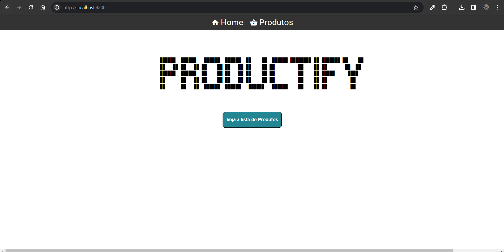
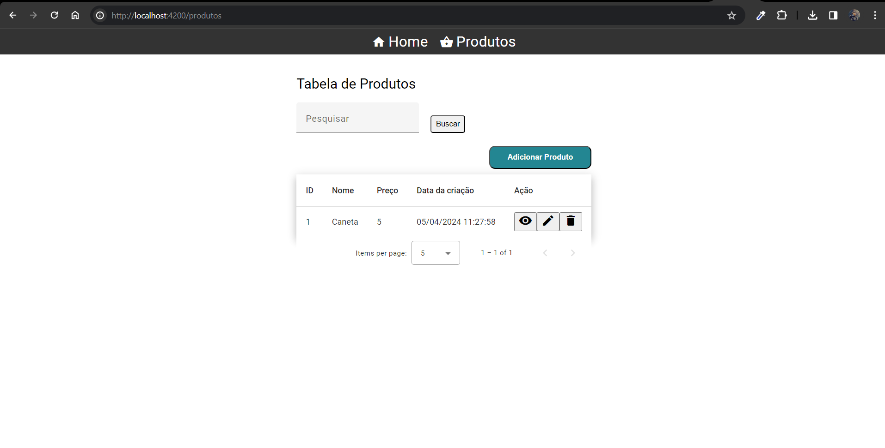
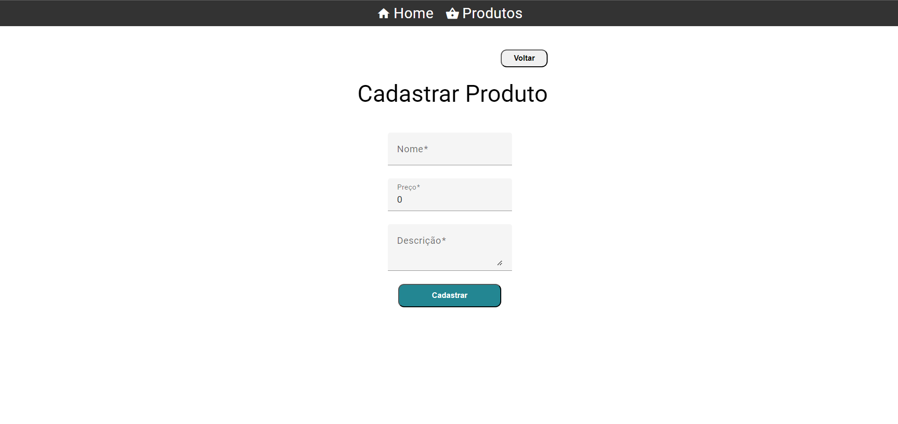
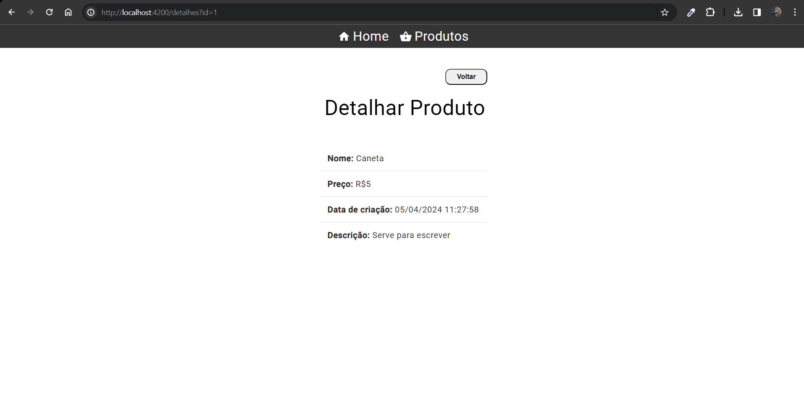
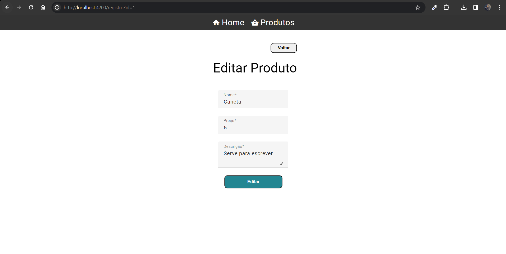

# Productify-Front

O projeto productify-front é um aplicação web com angular que interage com a api [productify-api](https://github.com/vinancius/Productify-back). Juntas elas formam um sistema de gerencia de um catálogo de produtos.

## Introdução

Essas instruções permitirão que você obtenha uma cópia do projeto em operação na sua máquina local para fins de desenvolvimento.

Consulte **[Implantação](#-implanta%C3%A7%C3%A3o)** para saber como implantar o projeto.

## Construído com

De que tecnológias que você precisa instalar?

* [Docker](https://www.docker.com/get-started/) - Gerenciar componentes de contêineres
* [Angular 17](https://angular.io/quick-start) - Framework web usado
* [Node v18.13.0](https://nodejs.org/dist/v18.13.0/node-v18.13.0-x64.msi) - Interpretador utilizado

### 🔧 Instalação e Execução

O projeto pode ser inicializado de duas formas:

Localmente sem o container:

```
npm i

ng serve
```

Localmente com docker:

```
docker build -t productify-back .

docker-compose up -d 
```

# Telas

##Tela inicial:


##Tela dos Produtos:


##Tela cadastrado de produto:


##Tela de Detalhe do Produto:


##Tela Editar produto
